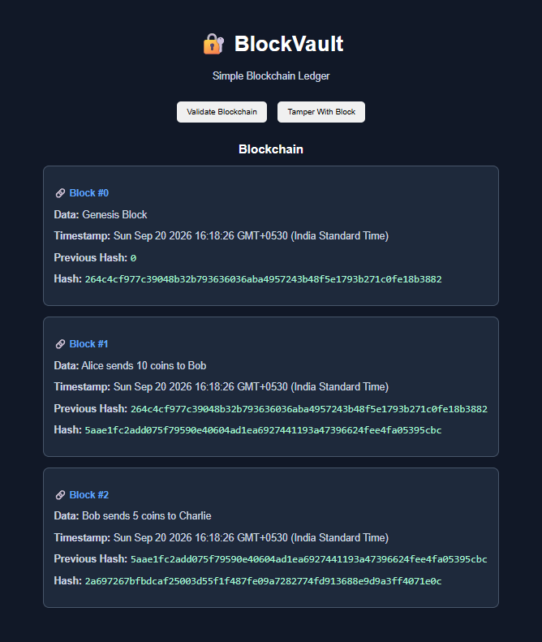

# 🔐 BlockVault

A simple blockchain ledger built using HTML, CSS, and JavaScript.

BlockVault demonstrates how blockchain blocks are connected using cryptographic hashes and how tampering with one block can invalidate the chain.

## 📸 Demo



## 🚀 Features

- Creates a Genesis Block
- Creates multiple blockchain blocks
- Generates SHA-256 hashes
- Links each block using the previous block's hash
- Validates the blockchain
- Demonstrates tamper detection
- Interactive browser interface

## 🛠️ Technologies Used

- HTML5
- CSS3
- JavaScript
- Web Crypto API
- SHA-256 Hashing

## 🧩 How It Works

Each block contains:

- Block index
- Transaction/data
- Timestamp
- Previous block hash
- Current block hash

The current block's hash depends on its contents.

If the data inside a block is changed, its hash changes.

Because the next block stores the previous block's original hash, the chain becomes invalid.

## 🔐 Tamper Detection

BlockVault provides a simple demonstration of blockchain integrity.

### Before Tampering

The blockchain validation returns:

✅ `true`

This means the blocks are correctly connected and the blockchain is valid.

### After Tampering

When a block is modified, the validation returns:

❌ `false`

This demonstrates how changing data inside a block breaks the integrity of the blockchain.

## 📂 Project Structure

```text
BlockVault/
│
├── index.html
├── style.css
├── script.js
├── blockvault-demo.png
└── README.md